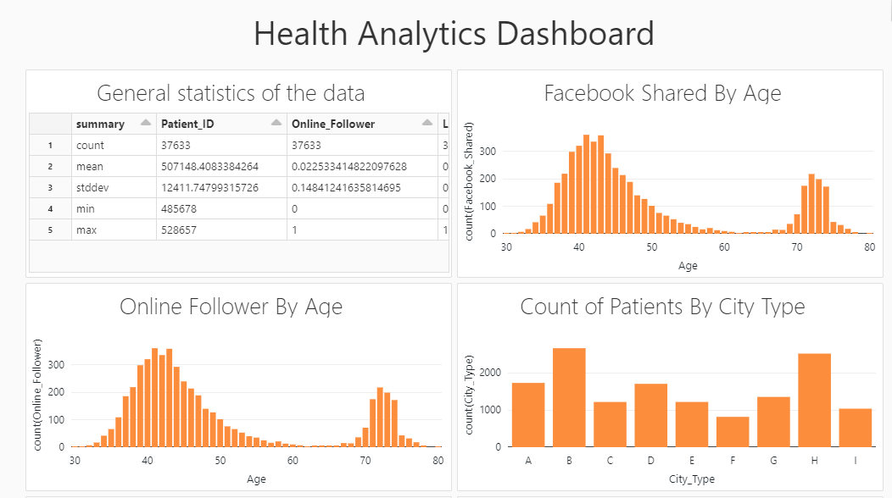

# RUNNING THE .dbc FILE ON DATABRICKS

## Prerequisites

- A Databricks account

## Steps

1. First, create a new workspace on Databricks.

2. Click on the "Workspace" button on the left sidebar, then select the "Import" button. 

3. Drag and drop the dbc file into the import window, or select the "Choose File" button to find it on your computer.

4. The imported file will now appear in your workspace. To run the notebook, double-click on the file and then click the "Run All" button in the top right corner of the notebook.

5. You can also schedule the notebook to run automatically at a specific time, by clicking on the "Edit" button in the top right corner of the notebook and then selecting "Schedule" in the dropdown menu.

## HEALTH DATA ANALYTICS DASHBOARD

## Dashboard link

You can access the dashboard by clicking on the link below:

[Dashboard](https://databricks-prod-cloudfront.cloud.databricks.com/public/4027ec902e239c93eaaa8714f173bcfc/635413746915330/2842400759732072/2547606093399996/latest.html)

Please Note: If the link is not accessible, it could be because the link is for a shared resource and the user does not have the permission to access it.
